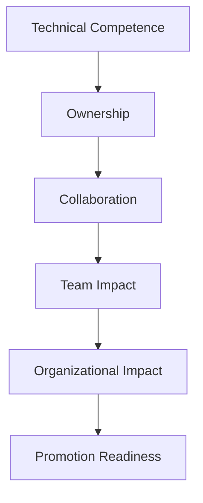

*A promotion should recognize readiness, not create it.*

*Promotions should recognize demonstrated readiness, not future potential.*

They were one of the most reliable engineers on the team: respected by their peers, careful with their work, and trusted to follow through.

Then one day, in a one-on-one, they told me they were considering opportunities elsewhere.

Their reason was not surprising. They felt their career progression had stalled, and they wanted to know what else they needed to do to be promoted.

I understood their frustration.

I also believed promoting them at that moment would have been the wrong decision.

That is one of the harder situations an engineering manager faces because it involves a person who is valuable, serious, and trying to grow.

But this situation also reveals an important question in engineering promotion conversations:

Why do good engineers sometimes not get promoted?

The answer is rarely that they are not working hard enough.

The real issue is that good performance in one role is not always enough evidence for the next one.

## TL;DR

- Promotion is not a reward for effort or tenure.
- Promotion should recognize current behavior at the next level.
- Technical excellence alone is insufficient for seniority.
- Organizational impact matters more than individual output.
- "Not yet" is often more useful than "no" when it is specific and actionable.

## Good Performance Is Not Promotion Readiness

### Promotion Is Not Just Appreciation

Many engineers understandably think about promotion as a reward.

They have delivered projects, helped during incidents, and built trust. From their perspective, an engineering promotion can feel like the natural recognition of that effort.

I understand that view. Managers sometimes reinforce it without meaning to because appreciation, retention, compensation, and career growth often show up in the same conversations.

But a promotion is not only a thank-you.

A promotion changes expectations.

At the next level, the organization is not simply asking for more of the same work. It is asking for a different shape of contribution.

A strong mid-level engineer may deliver assigned work with quality and consistency. A senior engineer is often expected to create clarity, identify risk early, drive outcomes across boundaries, and help others make better decisions.

Those are related skills, but they are not identical.

### What Readiness Looks Like

The difference often shows up in ownership.

Do they help define unclear work? Do they bring drifting projects back on track? Do they follow through after the code is merged? Do they understand the impact of the work, or only the task in front of them?

> **Promotion Readiness Signals**
>
> - Ownership
> - Follow-through
> - Collaboration
> - Team impact
> - Organizational impact

Promotion criteria should make these expectations explicit. Otherwise, people are left to guess, and they often optimize for visible effort rather than the behaviors that actually matter.

That is where disappointment begins.

## A Simple Readiness Model

Promotion readiness is not one behavior. It is a pattern that grows from technical competence into broader influence.

## Promotion Should Recognize Readiness, Not Create It

Over time, I have become increasingly convinced of one principle:

Promotions should recognize readiness, not create it.

Some organizations use promotion as a bet.

The thinking sounds reasonable at first: this person is talented, they are close, they need the title to grow, so let's promote them and they will rise into the role.

Sometimes that works. More often than people admit, it creates avoidable problems.

The newly promoted person now carries expectations they may not fully understand or consistently meet. The manager has less room to coach privately because the role has already changed publicly.

The rest of the team also receives a mixed signal. People begin to wonder whether titles reflect demonstrated behavior, manager preference, retention pressure, or timing.

> A promotion should not be a bet that someone will meet the expectations tomorrow. It should be recognition that they are already meeting them today.

This does not mean someone must be perfect before being promoted. Every level includes growth, and every newly promoted person will still need support.

The question is whether the important behaviors are already visible often enough that the organization can reasonably say: this is not a hope, this is a pattern.

When growth is visible before promotion, the title feels like recognition. When growth is expected only after promotion, the title becomes pressure.

## Individual Contribution Is Not Organizational Impact

### The Question Changes With Seniority

One pattern I have seen many times is an engineer who is very focused on their own output.

They complete tickets, solve hard technical problems, and write good code. They may even be one of the most productive people on the team by raw volume.

But as engineers grow, the question changes from "How much work do you personally finish?" to "What changes because you are here?"

Completing tasks is useful. Driving outcomes is more valuable. Solving a technical problem is useful. Reducing organizational risk is more valuable.

This is where the conversation can become uncomfortable. The engineer may be doing everything asked of them, while the next level requires influence beyond assigned tasks.

### From Output To Leverage

Maybe they notice that multiple teams are solving the same problem differently and create alignment. Maybe they improve a process that repeatedly causes incidents. Maybe they help leadership make a better trade-off.

Those examples are not about effort alone. They are about leverage.

Career growth requires making the contribution larger, not just making the calendar fuller.

| Focus | Individual Contributor Mindset | Promotion-Ready Mindset |
| --- | --- | --- |
| Success | Completing tasks | Driving outcomes |
| Ownership | Assigned work | End-to-end responsibility |
| Collaboration | Personal effectiveness | Team effectiveness |
| Feedback | Defends ideas | Improves ideas |
| Impact | Individual output | Organizational impact |

## Being Right Is Not Enough

### Technical Strength Can Still Limit Impact

Another difficult pattern involves technically strong engineers who are often right, but hard to move forward with.

They see problems quickly. They care about correctness. They have strong opinions about architecture, reliability, testing, and maintainability.

But they may also overengineer solutions, resist feedback, ignore team decisions, treat compromise as weakness, or optimize for technical elegance when the team needs a simpler answer that can ship safely.

This creates a different gap.

Engineering is a team sport.

> The goal is not to build the most elegant solution in isolation. The goal is to help the team move forward.

At more senior levels, technical excellence still matters. But technical excellence that cannot create alignment has limited organizational value.

A senior engineer needs to know when to push and when to listen. They need to disagree clearly without turning every disagreement into a battle.

They also need to accept feedback and understand that an imperfect decision can still be the right decision for the moment.

This is not about being passive.

Strong engineers should challenge weak plans, raise risks, protect quality, and bring technical judgment into the room. But leadership is also measured by what happens after the argument.

Does the team become clearer? Does trust increase? Does the work move forward? Do people feel safer bringing problems earlier next time?

If the answer is no, then being right is not enough.

> **Warning Signs**
>
> - Consistently missing context
> - Lack of alignment with team decisions
> - Slow execution
> - Resistance to feedback
> - Overengineering

## Promotions Shape Culture

Promotion decisions are not only individual career decisions. They are organizational design decisions.

Every promotion sends a signal.

It tells people what the company values and whether the written promotion criteria actually matter.

If someone is promoted mainly because they are loud, others learn to be louder. If someone is promoted despite poor collaboration, others learn that collaboration is optional.

If someone is promoted for heroics while quiet system improvement is ignored, the organization will get more heroics and less prevention.

Culture is not what leaders write in company values.

> Culture is what people observe getting rewarded.

That is why managers and leaders need to treat promotions seriously. A title is not just a line in an HR system. It becomes evidence.

Promotion decisions do not need to be perfect. They do need to be explainable against consistent standards.

## The Difference Between "No" and "Not Yet"

The worst promotion conversations are surprises.

If an engineer believes they are ready and the manager strongly disagrees, something has usually gone wrong before the actual decision.

Either the expectations were unclear, the feedback was too vague, or the manager avoided a difficult conversation for too long.

"Be more strategic" is not useful feedback.

"Show more leadership" is not useful feedback.

Those phrases may be directionally true, but they do not help someone change because they are not tied to observable examples.

Better feedback is concrete.

It might sound like:

- You need to take stronger ownership of projects after the initial implementation, especially through rollout, measurement, and follow-up.
- You need to improve follow-through when dependencies are unclear instead of waiting for someone else to unblock the work.
- You need to execute faster on scoped work before taking on broader design responsibilities.
- You need to collaborate more effectively when the team chooses a direction you disagree with.
- You need to demonstrate organizational impact beyond your assigned tasks.

That kind of feedback is harder to give because it requires evidence. It also gives the engineer something real to work with.

"Not yet" is one of the most important tools an engineering manager has. Used poorly, it becomes a delay tactic. Used well, it creates a clear path.

"Not yet" should mean: I see the path, here are the gaps, here is what strong evidence would look like, and I will help you get there.

## Key Takeaways

- Good performance in the current role is not always evidence for the next role.
- Titles should follow demonstrated behavior, not hoped-for future growth.
- Seniority requires collaboration, judgment, and follow-through, not only technical strength.
- Organizational impact is the clearest signal that someone is operating beyond individual output.
- Promotion decisions shape culture because they show what gets rewarded.

## Titles Should Follow Behavior

In the original conversation, I did not enjoy telling that engineer they were not ready yet.

I knew the answer might disappoint them. I knew they might still decide to leave. I also knew that promoting them too early would not serve them well.

It would have moved the discomfort into the future.

Instead of one hard conversation about readiness, we would eventually have a harder conversation about expectations.

Delaying a promotion can feel uncomfortable for both the manager and the engineer. But promoting someone before they are ready is often more harmful than saying "not yet" with honesty and support.

Titles should follow demonstrated behavior. Standards matter. Growth should be visible before promotion.

I have learned to take these decisions seriously because people remember them. They remember who was promoted. They remember why it seemed to happen. They remember whether the decision matched the values leaders claimed to care about.

Every promotion answers a question the entire organization is asking:

"What does success look like here?"

Leaders should make sure the answer is intentional.


